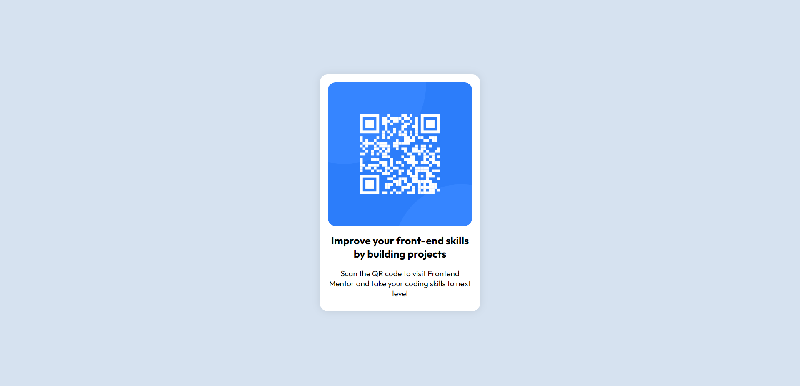

# Frontend Mentor - QR code component solution

This is a solution to the [QR code component challenge on Frontend Mentor](https://www.frontendmentor.io/challenges/qr-code-component-iux_sIO_H). Frontend Mentor challenges help you improve your coding skills by building realistic projects.

## Table of contents

- [Screenshot](#screenshot)
- [Links](#links)
- [Built with](#built-with)
- [Author](#author)
- [Acknowledgments](#acknowledgments)

### Screenshot

### Links

- Solution URL: [solution url](https://github.com/ArjunJayakrishnan/My-Repo.git)
- Live Site URL: [livelink url](https://arjunjayakrishnan.github.io/My-Repo/)

### Built with

- Semantic HTML5 markup
- CSS custom properties
- Flexbox
- desktop-first workflow

## Author

- Frontend Mentor - [@ArjunJayakrishnan](https://www.frontendmentor.io/profile/yourusername)

## Acknowledgments

I thank frontend mentor for giving me this challenge.
